# quadrupen: Sparsity by Worst-Case Quadratic Penalties


<!-- badges: start -->

[](https://github.com/jchiquet/quadrupen/actions/workflows/R-CMD-check.yaml)
<!-- badges: end -->

## Description

Fits the solution paths of classical sparse regression models with
efficient active set algorithms by solving small sub-problems. Depending
on the penalty, the sub-problems can be solved exactly (*i.e.* for the
LASSO) or with generic solvers. The available optimizer includes
quadratic solvers, Newton-based approaches and generic FISTA or PGD
algorithms. Also provides a few methods for model selection purpose
(information criteria, cross-validation, stability selection).

**Quadrupen** covers the following regularizers

- LASSO[^1] (Least Absolute Shrinkage and Selection Operator)
- SCAD[^2] (Smoothly Clipped Absolute Deviation)
- MCP[^3] (Minimax Concave Penalty)
- Group-LASSO[^4] ($\ell_1/\ell_2$ or $\ell_1/\ell_\infty$)
- Cooperative-LASSO[^5]
- Sparse Group-LASSO[^6] and Sparse Cooperative-LASSO
- Bounded Regression ($\ell_\infty$-norm).
- LAVA[^7] and the group-LAVA variants for all the group-sparse methods
- Ridge Regression[^8]

For all these regularizers, **Quadrupen** offers the possibility to add
an $\ell_2$/ridge-like “structured” penalty to embed some external
knowledge about the statistical dependence between the features. When
adding such a penalty to the LASSO, this is sometimes referred to as the
“Structured” or “Generalized” Elastic-Net”[^9].

We also provide in the package the implementation of the Generalized
Fused-LASSO[^10] originally proposed by Holger Hoefling now archived
from CRAN ([original repo here](https://github.com/cran/FusedLasso)).

The original version of **Quadrupen** only includes Lasso, Elastic-Net
and Bounded regression. It was used as an illustration for our paper
*“Sparsity by worst-case penalties”*[^11]. I eventually used it to
include my personal implementation of sparse methods for linear
regression.

While likely not as fast as highly specialized packages like *glmnet*,
the use of a working set algorithm combined with efficient solvers,
sparse matrix support when applicable, and templated C++ code makes it
both competitive and versatile.

## Installation

``` r
devtools::install_github("jchiquet/quadrupen")
```

[A couple of vignettes](https://jchiquet.github.io/quadrupen/articles/)
introduce the basics and more advanced uses of the functions and classes
implemented in the package. Other examples can be found in the
documentation and in the `inst` directory. Here is a more illustrative
one:

## Example: structured penalized regression

This example is extracted from chapter 1 of my
[habilitation](https://theses.hal.science/tel-01288976/). You can get
more insight by reading pages 65-66, 70-71.

First, load the package

``` r
library(quadrupen)
```

    'quadrupen' package version 1.0-0

### A toy data set advocating for structured regularization

See pages 29–30 in my
[habilitation](https://theses.hal.science/tel-01288976/). Code for
additional functions is given at the end of the present document
(Appendix).

We draw data from a linear regression where the regression parameters
are defined group-wise. The regressors are correlated according to the
same block pattern.

``` r
n <- 200
p <- 192

## model settings: block wise
mu <- 0
group <- c(p/4,p/8,p/4,p/8,p/4)
labels <- factor(rep(paste("group", 1:5), group))
beta   <- rep(c(0.25,1,-0.25,-1,0.25), group)
x <- rPred.block(n, p, sizes = group, rho=c(0.25, 0.75, 0.25, 0.75, 0.25))
```

Indeed, the correlation structure between the regressors exhibits a
strong pattern:

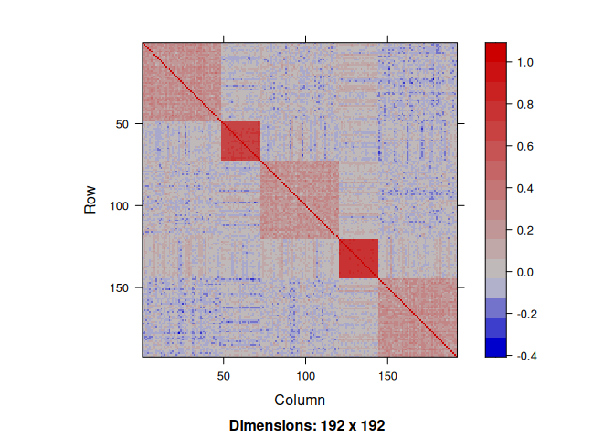

We draw the response variable by fixing the variance of the noise ratio
to get an $R^2$ equal to $0.8$.

``` r
dat <- rlm(x,beta,mu,r2=0.8)
y <- dat$y
sigma <- dat$sigma
```

### Regularization without prior knowledge

Now we try the available penalized regression methods in `quadrupen` to
fit the regularization path to this data set

#### Ridge regression ($\ell_2$ penalty)

``` r
plot(ridge(x,y, intercept=FALSE), labels=labels)
```

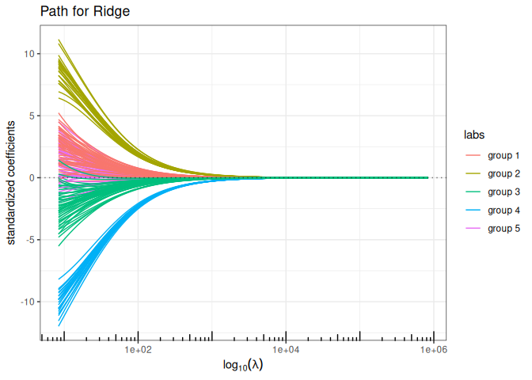

#### Lasso ($\ell_1$ penalty)

``` r
plot(lasso(x,y, intercept=FALSE), labels=labels)
```

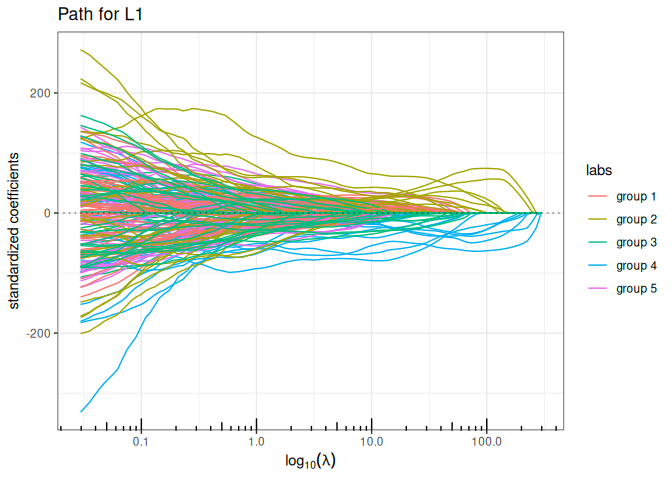

#### MCP (Minimax Concave Penalty)

``` r
plot(mcp(x,y, intercept=FALSE), labels=labels)
```

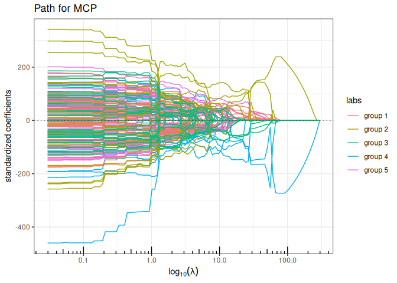

#### SCAD (Smoothly Clipped Absolute Deviation)

``` r
plot(scad(x,y, intercept=FALSE), labels=labels)
```

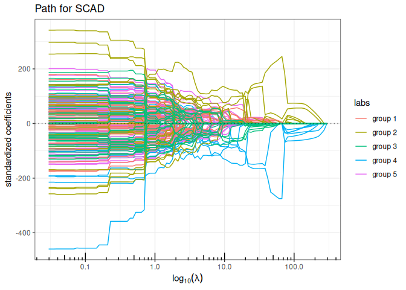

#### Fused-LASSO (contiguity penalty)

``` r
plot(fused_lasso(x,y, lambda2 = 5, intercept=FALSE), labels=labels)
```

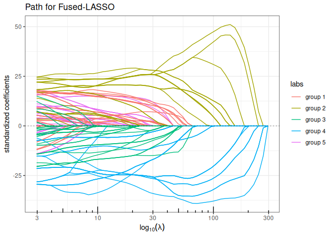

#### Elastic-net ($\ell_1+\ell_2$ penalty)

``` r
plot(elastic_net(x,y, lambda2=1, intercept=FALSE), labels=labels)
```

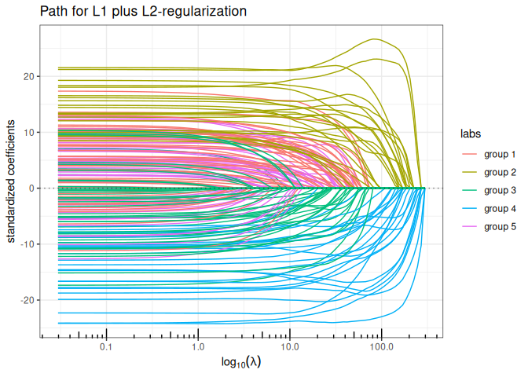

#### Bounded regression ($\ell_\infty$ penalty)

``` r
plot(bounded_reg(x,y, lambda2=0, intercept=FALSE), labels=labels)
```

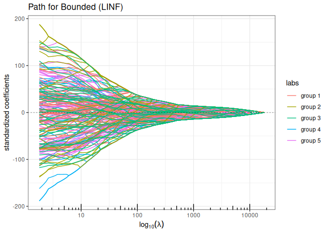

#### Bounded regression + Ridge ($\ell_\infty+\ell_2$ penalty)

``` r
plot(bounded_reg(x,y, lambda2=5, intercept=FALSE), labels=labels)
```

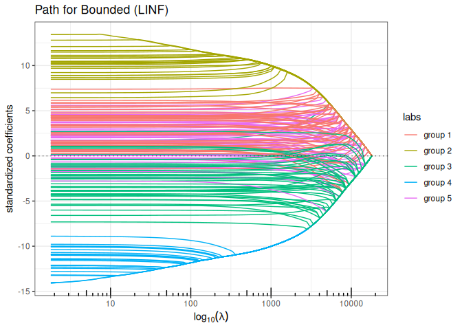

#### Lava (sparse + dense signal decomposition)

``` r
out_lava <- lava(x,y, lambda2=1, intercept=FALSE)
out_lava$plot_path(component = "sparse", labels=labels)
```

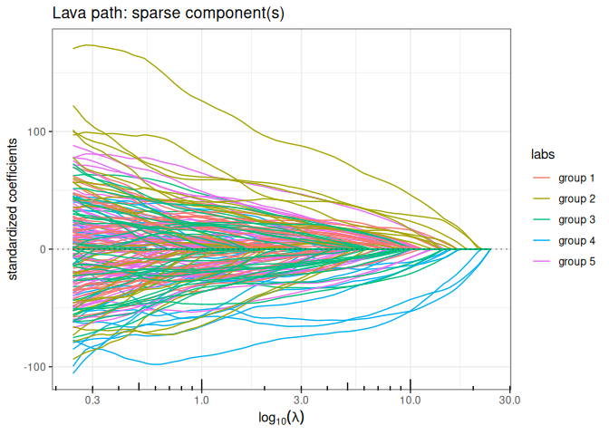

``` r
out_lava$plot_path(component = "dense", labels=labels)
```

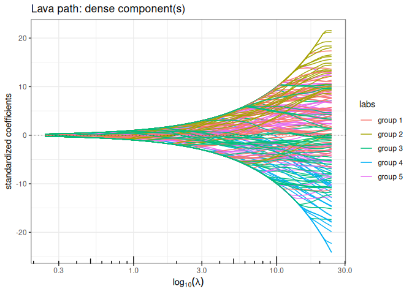

### Regularization with smooth prior knowledge

Now let’s define the graph associated with the groups of the regressor
and compute the Graph Laplacian. We add a small value on the diagonal to
ensure strict positive definiteness (in the future, this matrix should
preferentially be defined with a graph).

``` r
A <- Matrix::bdiag(lapply(group, function(s) matrix(1,s,s))) ; diag(A) <- 0
L <- -A; diag(L) <- Matrix::colSums(A) + 1e-2
```

Now, we run all the methods having a ridge-like regularization by
replacing the ridge penalty $\| \cdot \|_2^2$ with
$\| \cdot \|_{\mathbf{L}}^2$ to enforce some structure in the
regularization: the solution paths look a lot more convincing.

#### Structured/Generalized Ridge regression ($\ell_2$ penalty)

``` r
plot(ridge(x,y, lambda = 10^seq(4,-1,len=100), struct = L, intercept=FALSE), labels=labels)
```

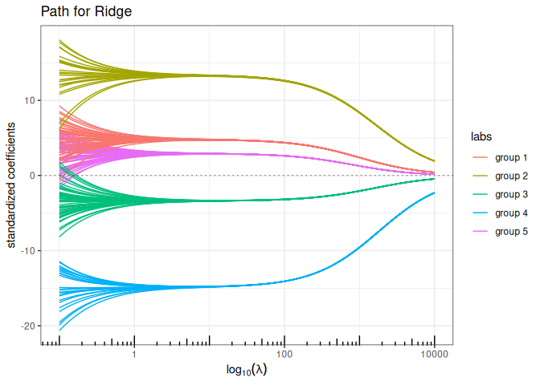

#### Structured/Generalized Elastic-net ($\ell_1+\ell_2$ penalty)

``` r
plot(elastic_net(x,y, struct = L, lambda2=1, intercept=FALSE), labels=labels)
```

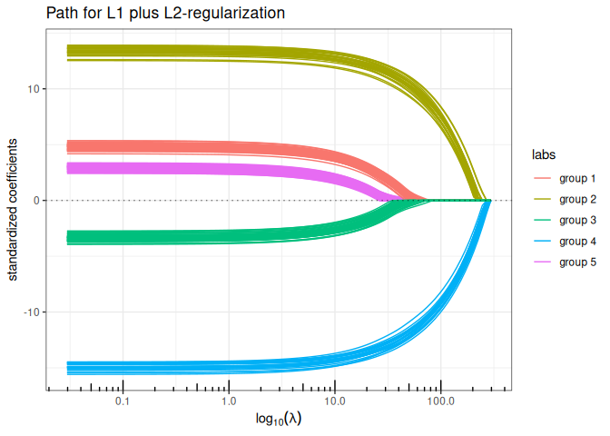

#### Bounded regression + structured/Generalized Ridge ($\ell_\infty+\ell_2$ penalty)

``` r
plot(bounded_reg(x,y, struct = L, lambda2=5, intercept=FALSE), labels=labels)
```

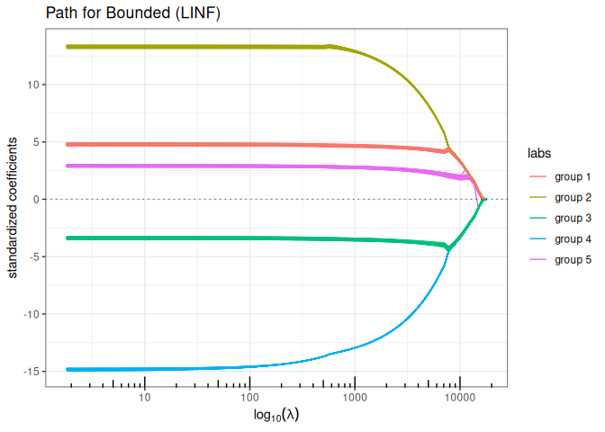

#### Lava (sparse + structured dense)

``` r
out_lava <- lava(x,y, lambda2=1, struct = L, intercept=FALSE)
out_lava$plot_path(component = "sparse", labels=labels)
```

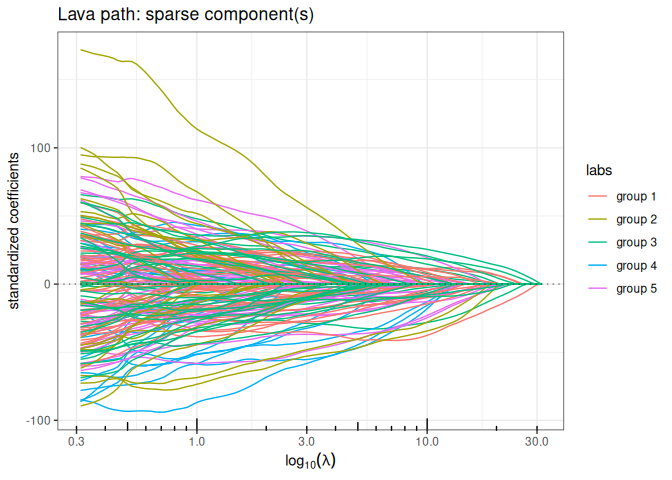

``` r
out_lava$plot_path(component = "dense", labels=labels)
```

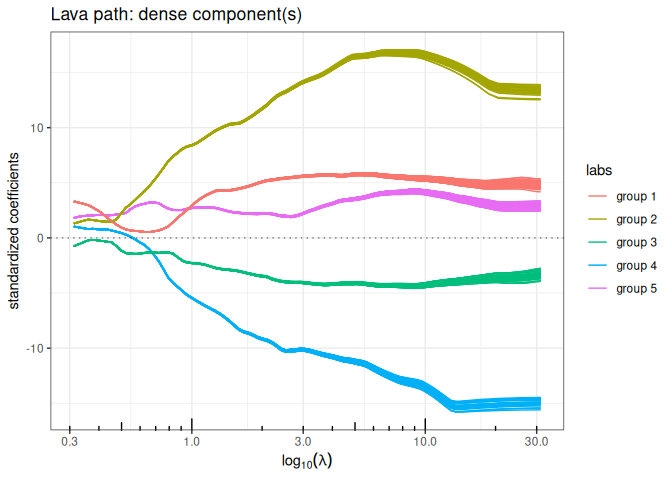

### Regularization with hard prior knowledge

We can use the correlation structure as a proxy for forming groups of
variables, and use group-sparse regularization. We offer three variants
of group sparse regularization in `quadrupen`: standard group-lasso
($\ell_1/\ell_2$ mixed norm), type 2 group Lasso ($\ell_1/\ell_\infty$
mixed norm) and the
[cooperative-lasso](https://doi.org/10.1214/11-AOAS520), an original
proposition.

We first define a group index vector to encode the group memberships:

``` r
group <- rep(1:length(group), group)
```

#### Group Lasso (group sparse L1/L2)

``` r
plot(group_lasso(x, y, group, intercept=FALSE), labels=labels)
```

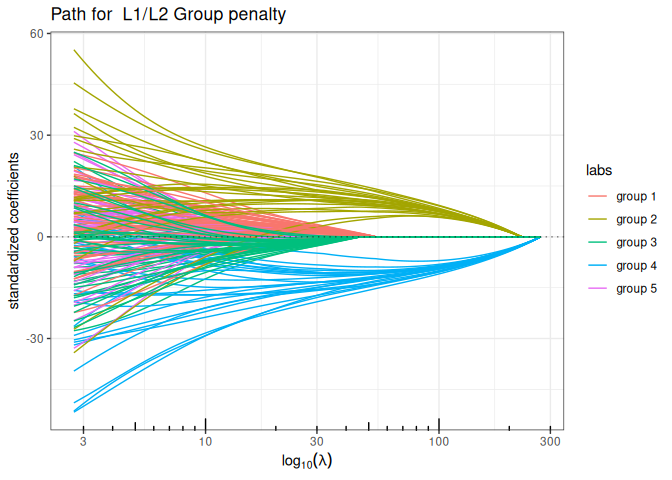

#### Sparse Group Lasso (mixing L1 + group sparse L1/L2)

``` r
plot(sparse_group_lasso(x, y, group, alpha = 0.75, intercept=FALSE), labels=labels)
```

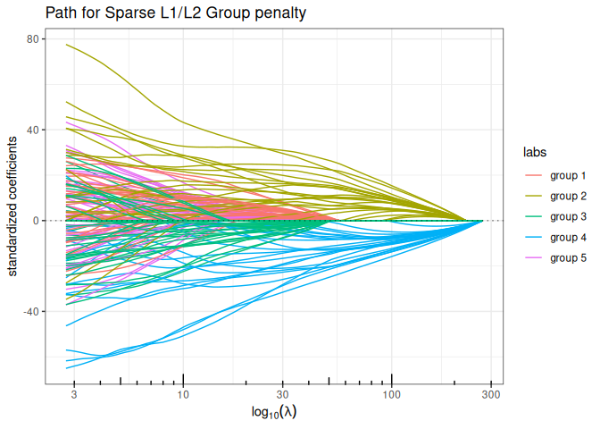

#### Group-Lasso (group sparse L1/LInf)

``` r
plot(group_l1linf(x, y, group, intercept=FALSE), labels=labels)
```

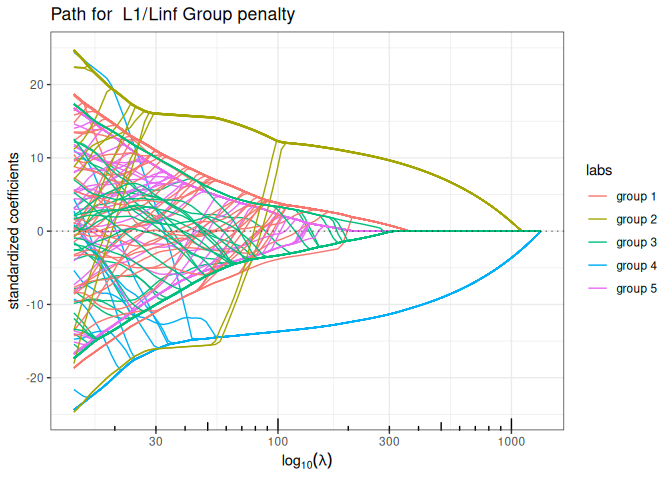

#### Sparse Group Lasso (mixing L1 + group sparse L1/LInf)

``` r
plot(sparse_group_l1linf(x, y, group, alpha = 0.75, intercept=FALSE), labels=labels)
```

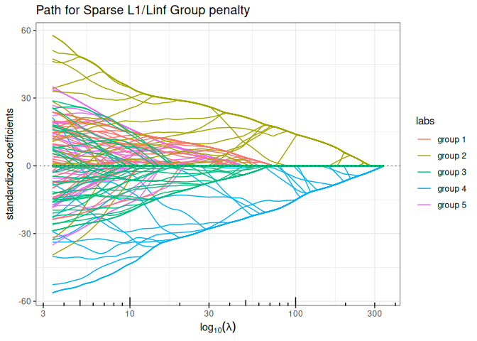

#### Cooperative-Lasso (sign-coherent group lasso)

``` r
plot(coop_lasso(x, y, group, intercept=FALSE), labels=labels)
```

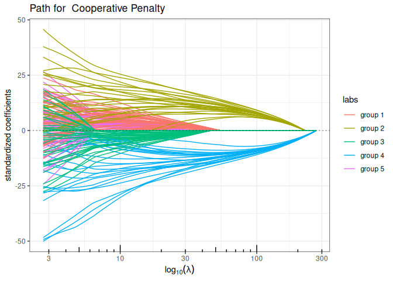

#### Sparse Cooperative Lasso (mixing L1 + Cooperative norm)

``` r
plot(sparse_coop_lasso(x, y, group, alpha = 0.75, intercept=FALSE), labels=labels)
```

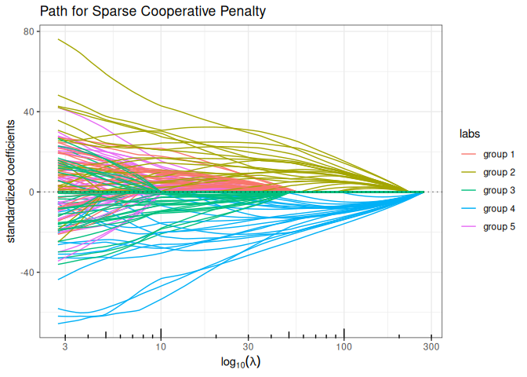

### Regularization mixing smooth and hard prior knowledge

We allow the possibility to add a structured-$\ell_2$ penalty to these
mixed-group penalties, in order to introduce additional smoothing prior
in the regularization, just like in the structured version of the
Elastic-Net and Ridge regression. For this, the function
`group_sparse_lm` is the most generic group-wise function, which
generalizes all the above models by allowing the addition of an
$\ell_2$-structured penalty.

#### Sparse Group-Lasso L2 + Structured ElasticNet (group sparse L1/L2 + structured L2)

``` r
plot(group_sparse_lm(x, y, group, type = "l2", alpha = 0.5, lambda2 = 2, struct = L, intercept=FALSE), labels=labels)
```

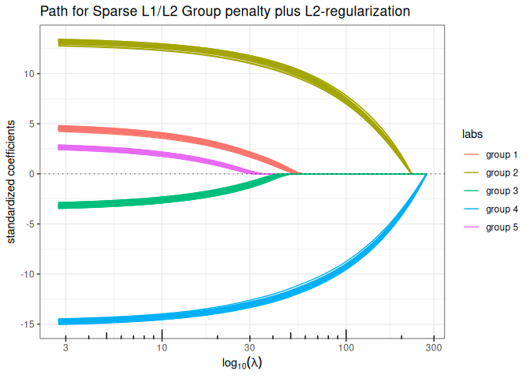

> [!NOTE]
>
> ### Disclaimer about the use of AI
>
> I wrote all the R and C++ code, which is a collection of various
> pieces accumulated over the years (except for the Fused-Lasso code,
> which was written by Holger Hoefling). I recently put all these pieces
> together. I used Claude code to help me refactor and optimise certain
> parts of the C++ code, as well as to review and generate parts of the
> documentation.

## Appendix: functions for data generation

``` r
chol.uniform <- function(p,rho) {

  q <- 0     ## sum_k^(i-1) c.k^2
  cii <- 1   ## current value of the diagonal
  c.i <- rho ## current value of the off-diagonal term
  Cii <- cii ## vector of diagonal terms
  C.i <- c.i ## vector of off-diagonal terms
  for (i in 2:p) {
    q <- q + c.i^2
    cii <- sqrt(1-q)
    c.i <- (rho-q)/cii
    Cii <- c(Cii,cii)
    C.i <- c(C.i,c.i)
  }
  return(list(cii=Cii, c.i=C.i[-p]))
}

rlm <- function(x,beta,mu=0,r2=NULL,sigma=1) {
  n <- nrow(x)
  if (!is.null(r2))
      sigma  <- as.numeric(sqrt((1-r2)/r2 * t(beta) %*% cov(x) %*% beta))
  epsilon <- rnorm(n) * sigma
  y <- mu + x %*% beta + epsilon
  r2 <- 1 - sum(epsilon^2) / sum((y-mean(y))^2)
  return(list(y=y,sigma=sigma))
}

## Blockwise structure
## the length of rho determine the number of blocs
## each group must be > 1 individual
rPred.block <- function(n, p, sizes=rmultinom(1,p,rep(p/K,K)), rho=rep(0.75,4)) {

  K <- length(rho)
  stopifnot(sum(sizes) == p | length(rho) != length(sizes))
  Cs <- lapply(1:K, function(k) chol.uniform(sizes[k],rho[k]))

  rmv <- function() {
      return(
      unlist(lapply(1:K, function(k) {
        z <- rnorm(sizes[k])
        Cs[[k]]$cii*z + c(0,cumsum(z[-sizes[k]]*Cs[[k]]$c.i))
      }))
      )
  }
  return(t(replicate(n, rmv(), simplify=TRUE)))
}
```

## References

[^1]: Tibshirani, Robert. “Regression shrinkage and selection via the
    lasso.” Journal of the Royal Statistical Society Series B:
    Statistical Methodology 58.1 (1996): 267-288.

[^2]: Fan, Jianqing, and Runze Li. “Variable selection via nonconcave
    penalized likelihood and its oracle properties.” Journal of the
    American statistical Association 96.456 (2001): 1348-1360.

[^3]: Zhang, C. H. Nearly unbiased variable selection under minimax
    concave penalty. The Annals of Statistics, 38(2), (2010): 894-942.

[^4]: Yuan, Ming, and Yi Lin. “Model selection and estimation in
    regression with grouped variables.” Journal of the Royal Statistical
    Society Series B: Statistical Methodology 68.1 (2006): 49-67.

[^5]: Chiquet, Julien, Yves Grandvalet, and Camille Charbonnier.
    “Sparsity with sign-coherent groups of variables via the
    cooperative-lasso.” (2012): 795-830.

[^6]: Simon, Noah, et al. “A sparse-group lasso.” Journal of
    computational and graphical statistics 22.2 (2013): 231-245.

[^7]: Chernozhukov, Victor, Christian Hansen, and Yuan Liao. “A lava
    attack on the recovery of sums of dense and sparse signals.” The
    Annals of Statistics (2017): 39-76.

[^8]: Hoerl, Arthur E., and Robert W. Kennard. “Ridge regression: Biased
    estimation for nonorthogonal problems.” Technometrics 12.1 (1970):
    55-67.

[^9]: Slawski, Martin. “The structured elastic net for quantile
    regression and support vector classification.” Statistics and
    Computing 22.1 (2012): 153-168.

[^10]: Hoefling, Holger. “A path algorithm for the fused lasso signal
    approximator.” Journal of Computational and Graphical Statistics
    19.4 (2010): 984-1006.

[^11]: Grandvalet, Yves, Julien Chiquet, and Christophe Ambroise.
    “Sparsity by worst-case penalties.” arXiv preprint arXiv:1210.2077
    (2012).
